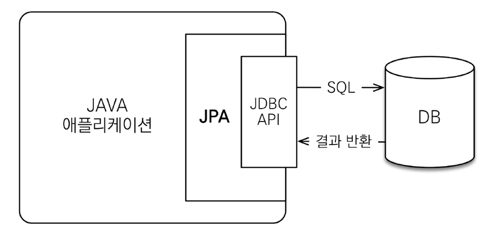
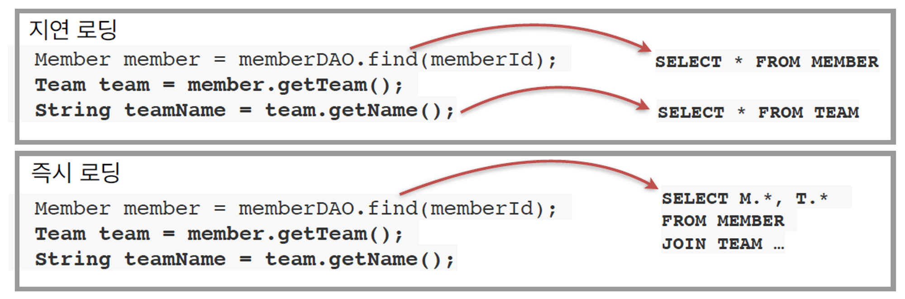
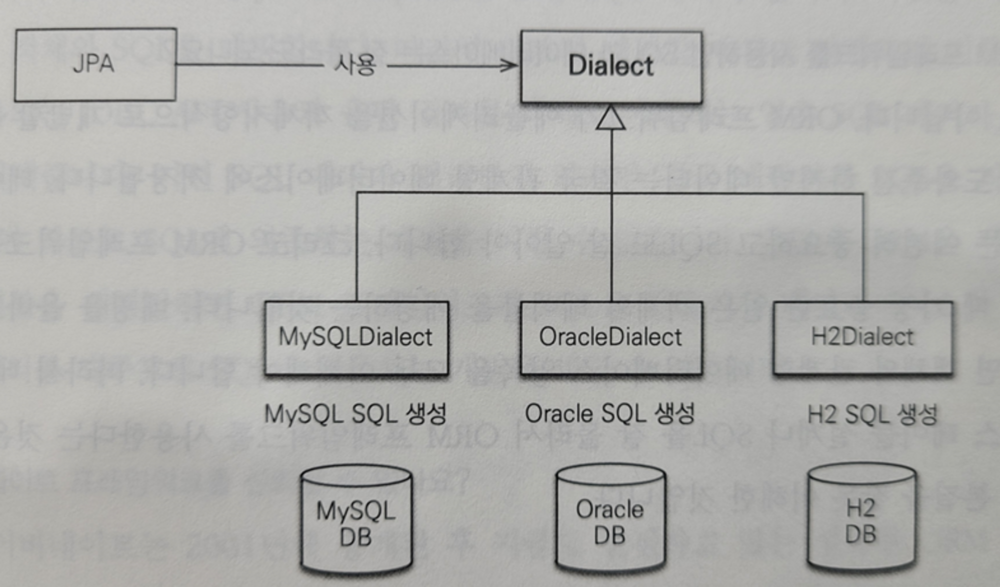
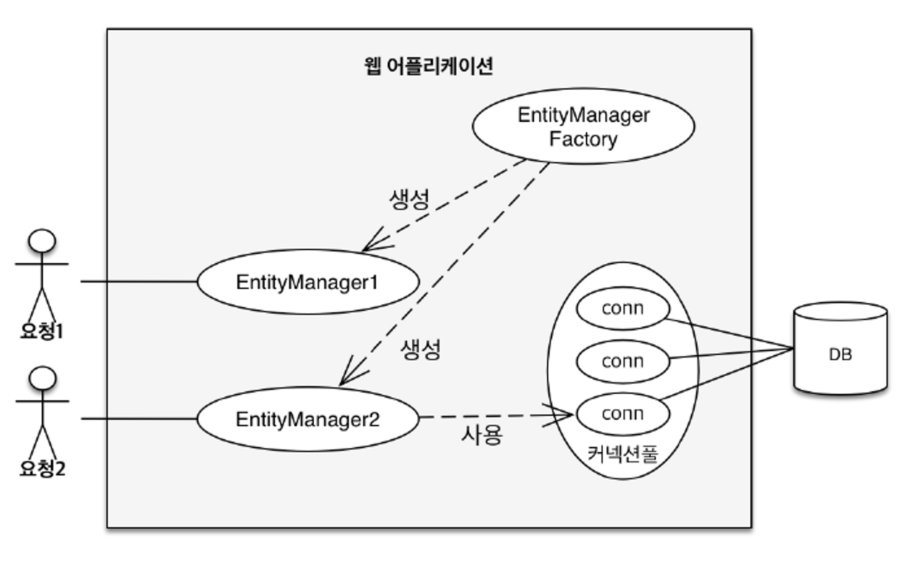
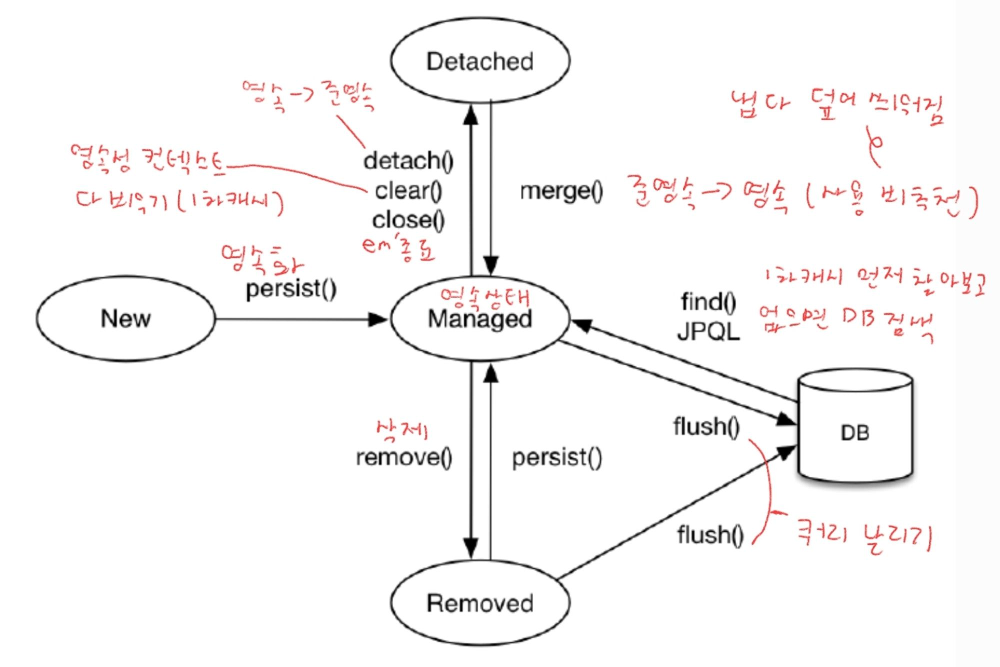
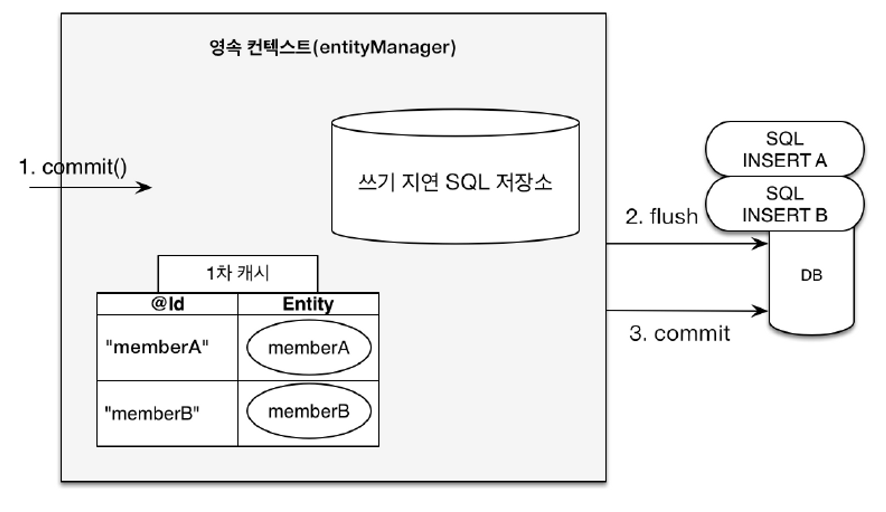
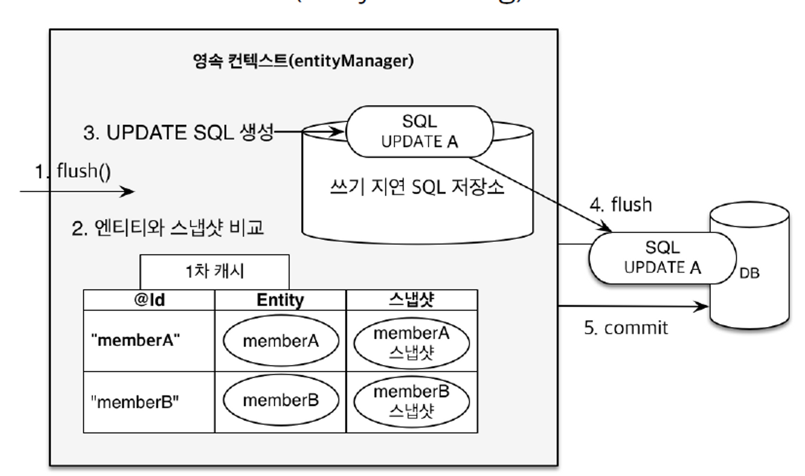

# 자바 ORM 표준 JPA 프로그래밍 - 기본편

## 강의 목표

- 객체와 테이블 설계 매핑
- JPA 내부 동작 방식 이해 (언제 어떤 SQL을 만들어서 실행하는지?

<br>

### 객체 ↔ 관계형 데이터베이스(RDBMS)의 차이

1. 상속
2. 연관 관계
3. 데이터타입
4. 데이터 식별 방법

<br>

### JPA  동작

- 애플리케이션 ↔ JDBC 사이에서 동작




<br>

#### JPA 인터페이스의 구현체 중 하나가 Hibernate (Hibernate, EclipseLink, DataNucleus)

<br>

### JPA - CRUD

- 저장 : `jpa.persist(member)`
- 조회 : `Member member = jpa.find(memberId)`
- 수정 (변경 감지) : `member.setName(”변경할 이름”)`
- 삭제 : `jpa.remove(member)`

<br>

### JPA와 패러다임 불일치 해결

1. 상속
  - `persist()`, `find()` 등을 하면 JPA가 알아서 상속 관계 데이터 값들을 넣고 빼줌
2. 연관 관계
3. 객체 그래프 탐색
4. 비교하기
   - 동일한 트랜잭션에서 동일한 식별자로 조회한 엔티티는 항상 같음을 보장

    ```java
    String memberId = "100";
    Member member1 = jpa.find(Member.class, memberId);
    Member member2 = jpa.find(Member.class, memberId);
    
    // True
    member1 == member2;
    ```


<br>

### JPA의 성능 최적화 기능

1. 1차 캐시와 동일성(identity) 보장
  - DB 격리 수준(Isolation Level)이 Read Commit(커밋된 읽기)이어도
    애플리케이션에서 Repeatable Read(반복 가능한 읽기) 보장
2. 트랜잭션을 지원하는 쓰기 지연
  - 트랜잭션 커밋시점까지 SQL을 보내지 않고 쌓아둠
  - 트랜잭션이 종료되어 commit()이 될 때 flush()를 통해 SQL이 한번에 나감
  - **수정, 삭제**할 때도 트랜잭션 커밋시점까지 쿼리를 묶어놓음으로써, 비즈니스 로직 수행동안 DB 로우 락이 걸리지 않는 효과
3. 지연 로딩 (Lazy Loading)
  - 지연 로딩: 객체가 실제 사용될 때 로딩
  - 즉시 로딩: JOIN SQL로 한번에 연관된 객체까지 미리 조회

  

<br>

### 정리

- ORM 프레임워크는 단순히 SQL을 개발자 대신 생성하여 DB에 전달해주는 것 뿐만 아니라, 다양한 패러다임의 불일치 문제들도 해결해준다
  - 상속
    - SQL로 하면 join을 통해 각자 가져와서 객체에 세팅해줘야함
    - 상속 객체는 인스턴스 생성 시 부모것도 자동으로 사용 가능
      - JPA가 `persist()`, `find()`같은 명령어 한 줄로 다 해결해줌
  - 연관 관계
    - 참조 객체 ↔ 외래키(FK)
  - 객체 그래프 탐색
    - SQL 쿼리에 따라서 객체 그래프의 탐색 가능범위가 결정된다
    - 따라서 JPA의 지연로딩, 즉시로딩을 통해 원하는 객체로 타고타고타고 가서 조회하자
  - 비교 : 동일성(==), 동등성(`equals()`)

- 성능적인 관점도 이점을 챙길 수 있다
  - JPA는 애플리케이션과 DB 사이에 계층 하나를 두고 동작하므로 최적화 관점에서 시도해 볼 수 있는 것들이 많다
    - 식별자가 같은 엔티티 조회 → 1차 캐시

- 데이터 접근 추상화
  - 각 DB마다 같은 기능이여도 사용법이 다른 경우가 많다
  - JPA를 통해 특정 데이터베이스 기술에 종속되지 않도록 할 수 있다

    


<br>

#### 모든 JPA의 데이터 변경 작업은 Transaction 안에서 이루어져야 한다

#### 모든 관계형 데이터베이스는 내부적으로 트랜잭션에 감싸져서 데이터 변경이 일어난다
  - RDB는 내부적으로 데이터 변경은 트랜잭션 안에서 일어나도록 설계되어 있다 

<br>

---


### 영속성 컨텍스트

- EntityManagerFactory : 애플리케이션 전체에서 최초 한번 생성 후 공유해서 사용
- EntityManager : 각 사용자 요청마다 생성
  - 엔티티 매니저를 통해 영속성 컨텍스트에 접근한다
  - DB 연결이 꼭 필요한 시점에 커넥션을 획득함 (ex. 트랜잭션 시작)
  - 쉽게 설명하면 영속성 컨텍스트 내부에 Map이 하나 있고, 키는 `@Id`로 매핑한 식별자, 값은 엔티티의 인스턴스가 있다고 보면 된다

  

<br>

### 영속성 컨텍스트 동작 구조

1. 사용자 요청이 들어 왔다!
2. 엔티티 매니저 생성
3. 트랜잭션 생성
4. 모든 SQL 쓰기 지연 저장소에 저장 + 영속 엔티티 1차 캐시
5. 트랜잭션 종료 → `commit()`
   1. flush → SQL 쓰기 지연 저장소에 있던 모든 쿼리가 DB에 날라감
   2. commit → DB가 커밋됨

<br>

### 엔티티의 생명주기

- 비영속 : 영속성 컨텍스트와 전혀 관계 없는 새로운 상태
- 영속 : 영속성 컨텍스트가 관리하고 있는 상태
- 준영속 : 영속성 컨텍스트에 저장되었다가 분리된 상태
- 삭제



<br><br>

### 영속성 컨텍스트의 장점

#### 1. 버퍼링 기능을 사용할 수 있다 (쓰기 지연)

- 최적화 할 수 있는 여지가 있음 (DB는 실제로 commit 시점까지만 SQL을 날려주면 됨)
- 아래 설정 값 만큼의 배치 쿼리를 모아서 한방에 SQL을 날릴 수 있음
  - `<property name="hibernate.jdbc.batch_size" value="10"/>`
  - 설정 값이 채워지면 쿼리 실행
  - [https://techblog.woowahan.com/2695/](https://techblog.woowahan.com/2695/)
- `transaction.commit()`이 발생될 때 모아놓았던 SQL을 한방에 실행

    

<br>

#### 2. 변경 감지 (Dirty Checking)

- 영속성 컨택스트에 flush가 일어남
- 1차 캐시에서 각 엔티티 객체 별로 Entity와 스냅샷을 비교하여 변경된 부분을 분석
- 변경된 컬럼 UPDATE 쿼리 발생

  

<br>

#### 3. 지연 로딩

- 지연 로딩은 실제 객체 대신 프록시 객체를 로딩해두고 해당 객체를 실제 사용할 때 영속성 컨텍스트를 통해 데이터를 불러오는 방법
- find()로 가져온 엔티티 객체 내 다른 엔티디를 사용(참조)하기 직전에 DB에서 가져오는 방법
  - Member 객체에는 Team이라는 엔티티도 포함되어 있는 상황
  - findMember()를 통해 가져온 Member는 **회원 테이블**만 검색
  - `member.getTeam()`으로 Team 엔티티를 사용(참조)하는 “시점”에 팀 테이블도 검색해서 가져오는 방법

<br>

#### 나머지 장점

- 1차 캐시
- 동일성(identity) 보장
  - 1차 캐시로 DB 트랜잭션 격리수준 중 “반복 가능한 읽기”(REPEATABLE READ)를 애플리케이션 차원에서 제공 가능

<br>

### 플러시

#### 플러시는 영속성 컨텍스트를 비우는 것이 아니다

> 영속성 컨텍스트를 비우는 기능은 `em.clear()`

- 플러시는 영속성 컨텍스트의 변경 내용들을 DB에 동기화 시키는 작업이다
  - 엔티티 객체 변경 감지
  - 쓰기 지연  SQL 저장소에 쌓여있는 쿼리들
- 일반적인 상황(`clear` 사용 x)에서는 영속성 컨텍스트가 비워지는 것이 아닌, 트랜잭션이 종료되어 `entityManager.close()`가 되면서 사라지는 것이다
- 플러시 매커니즘이 존재 가능한 이유 : 트랜잭션 (커밋 직전에만 동기화 하면 됨)
  - JPA에서는 대부분의 동시성, 데이터 정합성 등의 기능들은  DB의 트랜잭션을 위임하여 사용한다

<br>

### 플러시 발생 상황

- `em.flush()` 직접 호출
- 트랜잭션 커밋 - 플러시 자동 호출
- JPQL 쿼리 실행 - 플러시 자동 호출 설정이 default
  - JPQL 실행 직전에 flush가 동작하도록 내부적으로 구현되어 있다 (default)
  - 쿼리를 그대로 DB에 던지는 거기 때문에 이전 로직에 대한 쿼리들을 모두 flush 하는게 정합성 측면에서 안전하기 때문
  - 플러시 모드 옵션
    - `FlushModeType.AUTO` : 커밋 + 쿼리를 실행할 때 플러시 (default)
    - `FlushModeType.COMMIT` : 커밋할 때만 플러시

<br>

### 데이터베이스 스키마 자동 생성

- 애플리케이션 실행 시점에 JPA는 엔티티의 매핑 정보를 가지고 DDL을 생성해주는 기능을 지원
- 개발 환경에서만 사용해야되고, 운영에서는 설정을 꺼야됨 (`ddl-auto: none`)
- DDL 자동 생성 기능 옵션
  - `create` : 기존 테이블 삭제 후 다시 생성 (DROP + CREATE)
  - `create-drop` : create와 같으나 종료 시점에서 DROP (DROP + CREATE + DROP)
  - `update` : 스키마에 추가된 컬럼 부분만(삭제 컬럼은 제외) 반영 (운영 DB에서는 사용 금지)

---

**운영 환경뿐만 아니라 테스트 환경에서도 웬만하면 아래 두개만 사용해야됨**

  - `validate` : 엔티티와 테이블이 정상 매핑되었는지만 확인
  - `none` : 사용 안함

<br>

### 엔티티 매핑

#### `@Entity`

- 기본 생성자 필수 (protected 이상)
- final 클래스, enum, interface, inner 클래스 사용 불가
- 데이터를 DB에 저장할 필드에 final 사용은 당연히 안된다

#### `@Table`

- 엔티티 객체명과 테이블명이 다른 경우(ex. 회사 테이블 컨벤션), name을 통해 매핑할 테이블 이름을 설정
  - `@Table(name = “tb_user”)`

#### `@Column`

- 데이터베이스 컬럼명과 엔티티객채의 컬럼명이 다를 경우 name 속성으로 맞춰주면 됨
  - `@Cloumn(name = "name) private String username;`

#### 나머지 어노테이션

- `@Enumerated(EnumType.STRING)` : DB에는 enum타입이 없으므로, enum 객체 타입을 매핑
  - `EnumType.ORDINAL`이 default인데 enum **순서를 저장**하므로 사용하지 말자
  - `**EnumType.STRING`을 꼭!!!! 설정하여 enum의 이름을 DB에 저장하자**
- `@Temporal` : 날짜. 시간 타입 매핑  (`TemporalType` : 날짜, 시간, 날짜 + 시간)
  - `LocalDate`, `LocalDateTime`을 사용하면 어노테이션 생략 가능
- `@Lob` : 방대한 텍스트 타입 매핑 (ex. TEXT 타입)
- `@Transient` : DB랑 관련 없이 인메모리에서만 사용하는 필드  매핑

<br>

### 기본 키 매핑

#### `@Id`

- 애플리케이션 단에서 직접 ID를 할당하는 방식
- 기본 키를 비즈니스로 끌고 오는 것은 권장하지 않는다
  - Auto_Increament(MySQL) or Sequence(Oracle) 같이 DB가 지원하는 최적화 된 기본 키 전략을 위임해서 사용하는 것이 좋음

<br>

#### `@GeneratedValue`

- IDENTITY : 데이터베이스에 기본 키 전략을 위임하는 기능 (MySQL)

  > *`@GeneratedValue*(strategy = GenerationType.IDENTITY)`
  >
  - Id를 null로 세팅하고 insert를 하면 DB가 id 값을 생성하여 반환해줌
  - 해당 전략은 id 생성을 DB에 위임하므로, 실제 insert를 하기 전까진 id를 모름
  - 따라서 해당 전략은 예외적으로 persist() 되는 시점에 insert 쿼리가 DB로 바로 전달
    - 본래는 `persist()` 이후 트랜잭션 commit 시점에 flush가 일어나면서 쿼리 전달

<br>

- SEQUENCE : 유일한 값을 순서대로 생성하는 특별한 DB의 오브젝트 (ORACLE, H2)

  > `@GeneratedValue(strategy = GenerationType.SEQUENCE, generator = "제네레이터 명")`

    ```java
    @Entity
    @SequenceGenerator(name = “MEMBER_SEQ_GENERATOR", sequenceName = “MEMBER_SEQ", //매핑할 데이터베이스 시퀀스 이름
    initialValue = 1, allocationSize = 1)
    public class Member {
    
    @Id
    @GeneratedValue(strategy = GenerationType.SEQUENCE, generator = "MEMBER_SEQ_GENERATOR")
    private Long id;
    ```

  - IDENTITY 전략과 다르게, insert를 하지 않는 대신 sequence 테이블과의 통신을 함
  - 따라서 성능 관련 문제를 보완하기 위해 allocation으로 일정 시퀀스 수량을 미리 메모리에 땡겨오는 등의 기능 제공
    - DB에는 미리 sequence를 수량만큼 올려놓고, 메모리에서는 하나씩 사용
    - 미리 올려놓고 사용하기 때문에 동시성 이슈 없이 다양한 문제 해결 가능

<br>

- TABLE : 키 생성 전용 테이블을 하나 만들어서 DB 시퀀스를 흉내내는 전략

<br>

---

### 연관관계 매핑

> 객체지향 설계의 목표는 자율적인 객체들의 **협력 공동체**를 만드는 것이다.
>
- 객체를 테이블에 맞추어 데이터 중심으로 모델링하면, 협력 관계를 만들 수 없다.
  - 테이블 : 외래 키를 이용하여 join을 통해 연관된 테이블의 정보를 찾는다
    - `SELECT * FROM MEMBER m join TEAM t ON m.TEAM_ID = t.TEAM_ID`
  - 객체 : 참조를 사용해서 연관된 객체를 찾는다 (feat. 포함 관계(Composition))
    - `Team team = member.getTeam();`
- JPA는 이런 테이블과 객체 사이의 큰 간격을 해결해준다.

<br>

### 단방향 연관 관계

- `@JoinColumn`을 통해 연관관계를 매핑할 테이블의 pk값 필드를 설정하자
  - `@JoinColumn(name = "MEMBER_ID")`
- 단방향 매핑만으로도 객체와 테이블간 연관관계 매핑은 완료된다. 


<br>

### 양방향 연관 관계

- `mappedBy`는 처음에 이해하기 어려움으로, 객체와 테이블 간에 연관 관계를 맺는 차이를 이해해야 한다
- 객체와 테이블이 관계를 맺는 차이
  - 객체 연관 관계는 단방향 2개가 필요하다 (회원 → 팀 연관관계 1개, 팀 → 회원 연관관계 1개)
  - 테이블 연관 관계는 FK로 양쪽 다 참조할 수 있기에 1개면 된다 (양방향)
- 따라서 객체를 양방향으로 참조하려면 단방향 연관 관계를 2개 만들어야 한다

#### 처음에는 단방향 연관 관계만 설정해놓고 양방향이 필요한 시점에서 mappedBy를 설정하는 것이 뇌 건강에 좋을 수 있다.

<br>

### 연관관계의 주인

> 외래 키가 있는 곳을 연관 관계 주인으로 정해라 → 1:다 에서 “다”가 주인
>
- 주인이 아닌쪽(`mappedBy`)은 읽기만 가능하다
- 진짜 매핑(`@JoinColumn`)
  - FK를 갖고있는 테이블이 주인이다
  - 1 : 다 관계에서 “다”인 테이블이 주인
    - DB 입장에서는 외래키가 있는 곳이 무조건 “다”이다
    - 따라서 1:N 관계에서 N쪽(`@ManyToOne`)이 무조건 연관 관계의 주인이 된다
  - 연관 관계의 주인이 된다고 비즈니스의 중요한 요소를 하는 의미가 아니다. <br>
    단지 “다”쪽이 연관 관계의 주인을 맡는 것 뿐이다.
  - ex) 자동차(`1`)와 자동차 바퀴(`N`)에서 비즈니스 적으로는 자동차가 훨씬 중요하지만 연관 관계의 주인은 자동차 바퀴가 맡는다
- 가짜 매핑(`mappedBy`)
  - 주인의 반대편
  - read only → mappedBy인 컬럼의 데이터를 변경하더라도 DB에 반영 안됨

<br>

### 양방향 매핑시 가장 많이 하는 실수 및 주의 사항

<br>

#### 1. 연관 관계 주인에 값을 입력하지 않는 실수
   - mappedBy에 컬럼에 값을 넣어봤자 DB에는 적용 되지 않는다
   - mappedBy가 아닌 컬럼에 데이터를 set하고 persist()를 하자
#### 2. 1차 캐시를 고려하지 않아서 양방향 컬럼 사용 시 NPE 발생
   - 순수 객체 상태를 고려해서 항상 양쪽에 데이터 값을 설정하자
   - 연관 관계 주인에게만 값을 세팅하고 DB에 집어넣으면 데이터가 잘 들어가긴 하겠지만, `flush()` 가 일어나지 않은 상황에서 다른 추가 작업을 할 경우 `mappedBy` 컬럼에는 값이 세팅되어 있지 않는다
   - #### 따라서 `연관 관계 편의 메서드`를 사용하여 객체의 양방향도 보장해주자!
#### 3. 양방향 매핑시에 무한 루프를 조심하자
  - toString(), lombok, JSON 생성 라이브러리
#### 4. JPA 엔티티 필드 중 컬랙션은 선언할 때 초기화까지 해주는 것이 관례이다
  - ex) `private List<Member> members = new ArrayList<>!);`
  - add할 떄 NPE가 발생하지 않음

<br>

### 팁 정리

#### 단방향 매핑만으로도 이미 연관 관계 매핑은 완료이다

- 따라서 설계를 할 때는 단방향 매핑으로만 일단 설계를 다 완료해야한다
  - 단방향 매핑만으로 이미 연관 관계 매핑은 완료
  - 양방향 매핑은 반대 방향으로 조회(객체 그래프 탐색) 기능이 추가된 것 뿐
  - 따라서 **설계단에서 단방향 매핑을 잘 해놓고, 양방향은 필요할 때 추가해도 된다**
    - 테이블에 영향 없이 Entity에 코드 몇줄만 추가하면 되기 때문

<br>

#### 연관 관계의 주인은 외래 키(FK)의 위치를 기준으로 정하자

- 연관 관계 주인은 비즈니스적인 우위가 아닌 외래 키의 관리자라고 생각하자
- 따라서 외래 키(FK)를 갖고 있는 쪽이 연관 관계의 주인(매니저)으로 설정하자

<br>

#### 연관관계 편의 메서드는 굳이 연관관계 주인쪽이 아니더라도, 비즈니스 적으로 사용을 많이하는 쪽에 만드는 것이 좋을 것 같다

- ORDER_ITEM이 ORDER 테이블의  id를 FK로 갖고 있기에 연관 관계 주인이지만, <br>
  비즈니스적으로는 Order 도메인을 자주 사용하기 때문에 Order 객체에 연관관계 편의 메서드인 `addOrderItem()`를 만든다

<br>

#### JPA 상태를 변경하거나 연관 관계 편의 메서드인 경우에는 set보다는 다른 키워드를 사용

- `setMember()` → `changeMember()`

<br>

#### 컨트롤러에서 Entity를 절대 반환하지 마라 → ResponseDTO 사용
- 양방향 매핑 시 무한 루프를 조심해야 하는 요소중에 JSON 생성 라이브러리도 포함되는데, DTO로 반환하면 무한 루프 문제가 일어날 일이 거의 없다.

<br>

---
