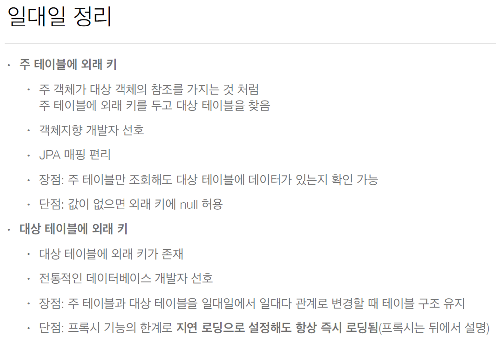
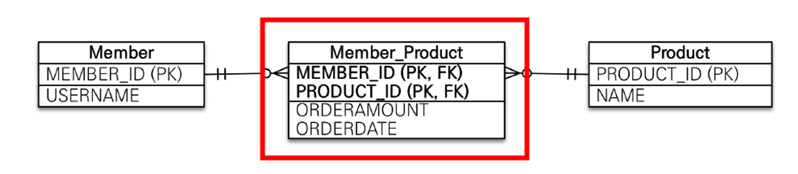
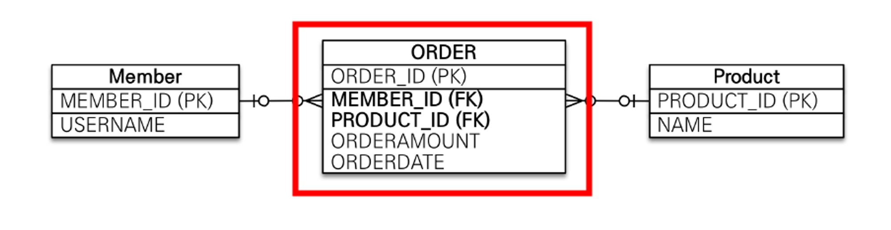

# 자바 ORM 표준 JPA 프로그래밍 - 기본편

## 강의 목표

- 객체와 테이블 설계 매핑
- JPA 내부 동작 방식 이해 (언제 어떤 SQL을 만들어서 실행하는지?

<br>

### 객체 ↔ 관계형 데이터베이스(RDBMS)의 차이

1. 상속
2. 연관 관계
3. 데이터타입
4. 데이터 식별 방법

<br>

### JPA  동작

- 애플리케이션 ↔ JDBC 사이에서 동작


<br>

#### JPA 인터페이스의 구현체 중 하나가 Hibernate (Hibernate, EclipseLink, DataNucleus)

<br>

### JPA - CRUD

- 저장 : `jpa.persist(member)`
- 조회 : `Member member = jpa.find(memberId)`
- 수정 (변경 감지) : `member.setName(”변경할 이름”)`
- 삭제 : `jpa.remove(member)`

<br>

### JPA와 패러다임 불일치 해결

1. 상속
  - `persist()`, `find()` 등을 하면 JPA가 알아서 상속 관계 데이터 값들을 넣고 빼줌
2. 연관 관계
3. 객체 그래프 탐색
4. 비교하기
   - 동일한 트랜잭션에서 동일한 식별자로 조회한 엔티티는 항상 같음을 보장

    ```java
    String memberId = "100";
    Member member1 = jpa.find(Member.class, memberId);
    Member member2 = jpa.find(Member.class, memberId);
    
    // True
    member1 == member2;
    ```


<br>

### JPA의 성능 최적화 기능

1. 1차 캐시와 동일성(identity) 보장
  - DB 격리 수준(Isolation Level)이 Read Commit(커밋된 읽기)이어도
    애플리케이션에서 Repeatable Read(반복 가능한 읽기) 보장
2. 트랜잭션을 지원하는 쓰기 지연
  - 트랜잭션 커밋시점까지 SQL을 보내지 않고 쌓아둠
  - 트랜잭션이 종료되어 commit()이 될 때 flush()를 통해 SQL이 한번에 나감
  - **수정, 삭제**할 때도 트랜잭션 커밋시점까지 쿼리를 묶어놓음으로써, 비즈니스 로직 수행동안 DB 로우 락이 걸리지 않는 효과
3. 지연 로딩 (Lazy Loading)
  - 지연 로딩: 객체가 실제 사용될 때 로딩
  - 즉시 로딩: JOIN SQL로 한번에 연관된 객체까지 미리 조회

  

<br>

### 정리

- ORM 프레임워크는 단순히 SQL을 개발자 대신 생성하여 DB에 전달해주는 것 뿐만 아니라, 다양한 패러다임의 불일치 문제들도 해결해준다
  - 상속
    - SQL로 하면 join을 통해 각자 가져와서 객체에 세팅해줘야함
    - 상속 객체는 인스턴스 생성 시 부모것도 자동으로 사용 가능
      - JPA가 `persist()`, `find()`같은 명령어 한 줄로 다 해결해줌
  - 연관 관계
    - 참조 객체 ↔ 외래키(FK)
  - 객체 그래프 탐색
    - SQL 쿼리에 따라서 객체 그래프의 탐색 가능범위가 결정된다
    - 따라서 JPA의 지연로딩, 즉시로딩을 통해 원하는 객체로 타고타고타고 가서 조회하자
  - 비교 : 동일성(==), 동등성(`equals()`)

- 성능적인 관점도 이점을 챙길 수 있다
  - JPA는 애플리케이션과 DB 사이에 계층 하나를 두고 동작하므로 최적화 관점에서 시도해 볼 수 있는 것들이 많다
    - 식별자가 같은 엔티티 조회 → 1차 캐시

- 데이터 접근 추상화
  - 각 DB마다 같은 기능이여도 사용법이 다른 경우가 많다
  - JPA를 통해 특정 데이터베이스 기술에 종속되지 않도록 할 수 있다

    


<br>

#### 모든 JPA의 데이터 변경 작업은 Transaction 안에서 이루어져야 한다

#### 모든 관계형 데이터베이스는 내부적으로 트랜잭션에 감싸져서 데이터 변경이 일어난다
  - RDB는 내부적으로 데이터 변경은 트랜잭션 안에서 일어나도록 설계되어 있다 

<br>

---


### 영속성 컨텍스트

- EntityManagerFactory : 애플리케이션 전체에서 최초 한번 생성 후 공유해서 사용
- EntityManager : 각 사용자 요청마다 생성
  - 엔티티 매니저를 통해 영속성 컨텍스트에 접근한다
  - DB 연결이 꼭 필요한 시점에 커넥션을 획득함 (ex. 트랜잭션 시작)
  - 쉽게 설명하면 영속성 컨텍스트 내부에 Map이 하나 있고, 키는 `@Id`로 매핑한 식별자, 값은 엔티티의 인스턴스가 있다고 보면 된다

  

<br>

### 영속성 컨텍스트 동작 구조

1. 사용자 요청이 들어 왔다!
2. 엔티티 매니저 생성
3. 트랜잭션 생성
4. 모든 SQL 쓰기 지연 저장소에 저장 + 영속 엔티티 1차 캐시
5. 트랜잭션 종료 → `commit()`
   1. flush → SQL 쓰기 지연 저장소에 있던 모든 쿼리가 DB에 날라감
   2. commit → DB가 커밋됨

<br>

### 엔티티의 생명주기

- 비영속 : 영속성 컨텍스트와 전혀 관계 없는 새로운 상태
- 영속 : 영속성 컨텍스트가 관리하고 있는 상태
- 준영속 : 영속성 컨텍스트에 저장되었다가 분리된 상태
- 삭제


<br><br>

### 영속성 컨텍스트의 장점

#### 1. 버퍼링 기능을 사용할 수 있다 (쓰기 지연)

- 최적화 할 수 있는 여지가 있음 (DB는 실제로 commit 시점까지만 SQL을 날려주면 됨)
- 아래 설정 값 만큼의 배치 쿼리를 모아서 한방에 SQL을 날릴 수 있음
  - `<property name="hibernate.jdbc.batch_size" value="10"/>`
  - 설정 값이 채워지면 쿼리 실행
  - [https://techblog.woowahan.com/2695/](https://techblog.woowahan.com/2695/)
- `transaction.commit()`이 발생될 때 모아놓았던 SQL을 한방에 실행

    

<br>

#### 2. 변경 감지 (Dirty Checking)

- 영속성 컨택스트에 flush가 일어남
- 1차 캐시에서 각 엔티티 객체 별로 Entity와 스냅샷을 비교하여 변경된 부분을 분석
- 변경된 컬럼 UPDATE 쿼리 발생

  

<br>

#### 3. 지연 로딩

- 지연 로딩은 실제 객체 대신 프록시 객체를 로딩해두고 해당 객체를 실제 사용할 때 영속성 컨텍스트를 통해 데이터를 불러오는 방법
- find()로 가져온 엔티티 객체 내 다른 엔티디를 사용(참조)하기 직전에 DB에서 가져오는 방법
  - Member 객체에는 Team이라는 엔티티도 포함되어 있는 상황
  - findMember()를 통해 가져온 Member는 **회원 테이블**만 검색
  - `member.getTeam()`으로 Team 엔티티를 사용(참조)하는 “시점”에 팀 테이블도 검색해서 가져오는 방법

<br>

#### 나머지 장점

- 1차 캐시
- 동일성(identity) 보장
  - 1차 캐시로 DB 트랜잭션 격리수준 중 “반복 가능한 읽기”(REPEATABLE READ)를 애플리케이션 차원에서 제공 가능

<br>

### 플러시

#### 플러시는 영속성 컨텍스트를 비우는 것이 아니다

> 영속성 컨텍스트를 비우는 기능은 `em.clear()`

- 플러시는 영속성 컨텍스트의 변경 내용들을 DB에 동기화 시키는 작업이다
  - 엔티티 객체 변경 감지
  - 쓰기 지연  SQL 저장소에 쌓여있는 쿼리들
- 일반적인 상황(`clear` 사용 x)에서는 영속성 컨텍스트가 비워지는 것이 아닌, 트랜잭션이 종료되어 `entityManager.close()`가 되면서 사라지는 것이다
- 플러시 매커니즘이 존재 가능한 이유 : 트랜잭션 (커밋 직전에만 동기화 하면 됨)
  - JPA에서는 대부분의 동시성, 데이터 정합성 등의 기능들은  DB의 트랜잭션을 위임하여 사용한다

<br>

### 플러시 발생 상황

- `em.flush()` 직접 호출
- 트랜잭션 커밋 - 플러시 자동 호출
- JPQL 쿼리 실행 - 플러시 자동 호출 설정이 default
  - JPQL 실행 직전에 flush가 동작하도록 내부적으로 구현되어 있다 (default)
  - 쿼리를 그대로 DB에 던지는 거기 때문에 이전 로직에 대한 쿼리들을 모두 flush 하는게 정합성 측면에서 안전하기 때문
  - 플러시 모드 옵션
    - `FlushModeType.AUTO` : 커밋 + 쿼리를 실행할 때 플러시 (default)
    - `FlushModeType.COMMIT` : 커밋할 때만 플러시

<br>

### 데이터베이스 스키마 자동 생성

- 애플리케이션 실행 시점에 JPA는 엔티티의 매핑 정보를 가지고 DDL을 생성해주는 기능을 지원
- 개발 환경에서만 사용해야되고, 운영에서는 설정을 꺼야됨 (`ddl-auto: none`)
- DDL 자동 생성 기능 옵션
  - `create` : 기존 테이블 삭제 후 다시 생성 (DROP + CREATE)
  - `create-drop` : create와 같으나 종료 시점에서 DROP (DROP + CREATE + DROP)
  - `update` : 스키마에 추가된 컬럼 부분만(삭제 컬럼은 제외) 반영 (운영 DB에서는 사용 금지)

---

**운영 환경뿐만 아니라 테스트 환경에서도 웬만하면 아래 두개만 사용해야됨**

  - `validate` : 엔티티와 테이블이 정상 매핑되었는지만 확인
  - `none` : 사용 안함

<br>

### 엔티티 매핑

#### `@Entity`

- 기본 생성자 필수 (protected 이상)
- final 클래스, enum, interface, inner 클래스 사용 불가
- 데이터를 DB에 저장할 필드에 final 사용은 당연히 안된다

#### `@Table`

- 엔티티 객체명과 테이블명이 다른 경우(ex. 회사 테이블 컨벤션), name을 통해 매핑할 테이블 이름을 설정
  - `@Table(name = “tb_user”)`

#### `@Column`

- 데이터베이스 컬럼명과 엔티티객채의 컬럼명이 다를 경우 name 속성으로 맞춰주면 됨
  - `@Cloumn(name = "name) private String username;`

#### 나머지 어노테이션

- `@Enumerated(EnumType.STRING)` : DB에는 enum타입이 없으므로, enum 객체 타입을 매핑
  - `EnumType.ORDINAL`이 default인데 enum **순서를 저장**하므로 사용하지 말자
  - `**EnumType.STRING`을 꼭!!!! 설정하여 enum의 이름을 DB에 저장하자**
- `@Temporal` : 날짜. 시간 타입 매핑  (`TemporalType` : 날짜, 시간, 날짜 + 시간)
  - `LocalDate`, `LocalDateTime`을 사용하면 어노테이션 생략 가능
- `@Lob` : 방대한 텍스트 타입 매핑 (ex. TEXT 타입)
- `@Transient` : DB랑 관련 없이 인메모리에서만 사용하는 필드  매핑

<br>

### 기본 키 매핑

#### `@Id`

- 애플리케이션 단에서 직접 ID를 할당하는 방식
- 기본 키를 비즈니스로 끌고 오는 것은 권장하지 않는다
  - Auto_Increament(MySQL) or Sequence(Oracle) 같이 DB가 지원하는 최적화 된 기본 키 전략을 위임해서 사용하는 것이 좋음

<br>

#### `@GeneratedValue`

- IDENTITY : 데이터베이스에 기본 키 전략을 위임하는 기능 (MySQL)

  > *`@GeneratedValue*(strategy = GenerationType.IDENTITY)`
  >
  - Id를 null로 세팅하고 insert를 하면 DB가 id 값을 생성하여 반환해줌
  - 해당 전략은 id 생성을 DB에 위임하므로, 실제 insert를 하기 전까진 id를 모름
  - 따라서 해당 전략은 예외적으로 persist() 되는 시점에 insert 쿼리가 DB로 바로 전달
    - 본래는 `persist()` 이후 트랜잭션 commit 시점에 flush가 일어나면서 쿼리 전달

<br>

- SEQUENCE : 유일한 값을 순서대로 생성하는 특별한 DB의 오브젝트 (ORACLE, H2)

  > `@GeneratedValue(strategy = GenerationType.SEQUENCE, generator = "제네레이터 명")`

    ```java
    @Entity
    @SequenceGenerator(name = “MEMBER_SEQ_GENERATOR", sequenceName = “MEMBER_SEQ", //매핑할 데이터베이스 시퀀스 이름
    initialValue = 1, allocationSize = 1)
    public class Member {
    
    @Id
    @GeneratedValue(strategy = GenerationType.SEQUENCE, generator = "MEMBER_SEQ_GENERATOR")
    private Long id;
    ```

  - IDENTITY 전략과 다르게, insert를 하지 않는 대신 sequence 테이블과의 통신을 함
  - 따라서 성능 관련 문제를 보완하기 위해 allocation으로 일정 시퀀스 수량을 미리 메모리에 땡겨오는 등의 기능 제공
    - DB에는 미리 sequence를 수량만큼 올려놓고, 메모리에서는 하나씩 사용
    - 미리 올려놓고 사용하기 때문에 동시성 이슈 없이 다양한 문제 해결 가능

<br>

- TABLE : 키 생성 전용 테이블을 하나 만들어서 DB 시퀀스를 흉내내는 전략

<br>

---

### 연관관계 매핑

> 객체지향 설계의 목표는 자율적인 객체들의 **협력 공동체**를 만드는 것이다.
>
- 객체를 테이블에 맞추어 데이터 중심으로 모델링하면, 협력 관계를 만들 수 없다.
  - 테이블 : 외래 키를 이용하여 join을 통해 연관된 테이블의 정보를 찾는다
    - `SELECT * FROM MEMBER m join TEAM t ON m.TEAM_ID = t.TEAM_ID`
  - 객체 : 참조를 사용해서 연관된 객체를 찾는다 (feat. 포함 관계(Composition))
    - `Team team = member.getTeam();`
- JPA는 이런 테이블과 객체 사이의 큰 간격을 해결해준다.

<br>

### 단방향 연관 관계

- `@JoinColumn`을 통해 연관관계를 매핑할 테이블의 pk값 필드를 설정하자
  - `@JoinColumn(name = "MEMBER_ID")`
- 단방향 매핑만으로도 객체와 테이블간 연관관계 매핑은 완료된다. 


<br>

### 양방향 연관 관계

- `mappedBy`는 처음에 이해하기 어려움으로, 객체와 테이블 간에 연관 관계를 맺는 차이를 이해해야 한다
- 객체와 테이블이 관계를 맺는 차이
  - 객체 연관 관계는 단방향 2개가 필요하다 (회원 → 팀 연관관계 1개, 팀 → 회원 연관관계 1개)
  - 테이블 연관 관계는 FK로 양쪽 다 참조할 수 있기에 1개면 된다 (양방향)
- 따라서 객체를 양방향으로 참조하려면 단방향 연관 관계를 2개 만들어야 한다

#### 처음에는 단방향 연관 관계만 설정해놓고 양방향이 필요한 시점에서 mappedBy를 설정하는 것이 뇌 건강에 좋을 수 있다.

<br>

### 연관관계의 주인

> 외래 키가 있는 곳을 연관 관계 주인으로 정해라 → 1:다 에서 “다”가 주인
>
- 주인이 아닌쪽(`mappedBy`)은 읽기만 가능하다
- 진짜 매핑(`@JoinColumn`)
  - FK를 갖고있는 테이블이 주인이다
  - 1 : 다 관계에서 “다”인 테이블이 주인
    - DB 입장에서는 외래키가 있는 곳이 무조건 “다”이다
    - 따라서 1:N 관계에서 N쪽(`@ManyToOne`)이 무조건 연관 관계의 주인이 된다
  - 연관 관계의 주인이 된다고 비즈니스의 중요한 요소를 하는 의미가 아니다. <br>
    단지 “다”쪽이 연관 관계의 주인을 맡는 것 뿐이다.
  - ex) 자동차(`1`)와 자동차 바퀴(`N`)에서 비즈니스 적으로는 자동차가 훨씬 중요하지만 연관 관계의 주인은 자동차 바퀴가 맡는다
- 가짜 매핑(`mappedBy`)
  - 주인의 반대편
  - read only → mappedBy인 컬럼의 데이터를 변경하더라도 DB에 반영 안됨

<br>

### 양방향 매핑시 가장 많이 하는 실수 및 주의 사항

<br>

#### 1. 연관 관계 주인에 값을 입력하지 않는 실수
   - mappedBy에 컬럼에 값을 넣어봤자 DB에는 적용 되지 않는다
   - mappedBy가 아닌 컬럼에 데이터를 set하고 persist()를 하자
#### 2. 1차 캐시를 고려하지 않아서 양방향 컬럼 사용 시 NPE 발생
   - 순수 객체 상태를 고려해서 항상 양쪽에 데이터 값을 설정하자
   - 연관 관계 주인에게만 값을 세팅하고 DB에 집어넣으면 데이터가 잘 들어가긴 하겠지만, `flush()` 가 일어나지 않은 상황에서 다른 추가 작업을 할 경우 `mappedBy` 컬럼에는 값이 세팅되어 있지 않는다
   - #### 따라서 `연관 관계 편의 메서드`를 사용하여 객체의 양방향도 보장해주자!
#### 3. 양방향 매핑시에 무한 루프를 조심하자
  - toString(), lombok, JSON 생성 라이브러리
#### 4. JPA 엔티티 필드 중 컬랙션은 선언할 때 초기화까지 해주는 것이 관례이다
  - ex) `private List<Member> members = new ArrayList<>!);`
  - add할 떄 NPE가 발생하지 않음

<br>

### 팁 정리

#### 단방향 매핑만으로도 이미 연관 관계 매핑은 완료이다

- 따라서 설계를 할 때는 단방향 매핑으로만 일단 설계를 다 완료해야한다
  - 단방향 매핑만으로 이미 연관 관계 매핑은 완료
  - 양방향 매핑은 반대 방향으로 조회(객체 그래프 탐색) 기능이 추가된 것 뿐
  - 따라서 **설계단에서 단방향 매핑을 잘 해놓고, 양방향은 필요할 때 추가해도 된다**
    - 테이블에 영향 없이 Entity에 코드 몇줄만 추가하면 되기 때문

<br>

#### 연관 관계의 주인은 외래 키(FK)의 위치를 기준으로 정하자

- 연관 관계 주인은 비ㅐ즈니스적인 우위가 아닌 외래 키의 관리자라고 생각하자
- 따라서 외래 키(FK)를 갖고 있는 쪽이 연관 관계의 주인(매니저)으로 설정하자

<br>

#### 연관관계 편의 메서드는 굳이 연관관계 주인쪽이 아니더라도, 비즈니스 적으로 사용을 많이하는 쪽에 만드는 것이 좋을 것 같다

- ORDER_ITEM이 ORDER 테이블의  id를 FK로 갖고 있기에 연관 관계 주인이지만, <br>
  비즈니스적으로는 Order 도메인을 자주 사용하기 때문에 Order 객체에 연관관계 편의 메서드인 `addOrderItem()`를 만든다

<br>

#### JPA 상태를 변경하거나 연관 관계 편의 메서드인 경우에는 set보다는 다른 키워드를 사용

- `setMember()` → `changeMember()`

<br>

#### 컨트롤러에서 Entity를 절대 반환하지 마라 → ResponseDTO 사용
- 양방향 매핑 시 무한 루프를 조심해야 하는 요소중에 JSON 생성 라이브러리도 포함되는데, DTO로 반환하면 무한 루프 문제가 일어날 일이 거의 없다.

<br>

---

### 연관 관계 매핑 흐름

1. 다중성 고려 : 두 엔티티가 일대일인지 일대다인지 판단
2. 단방향, 양방향 : 한쪽만 참조하는지, 양쪽 다 참조하는지 판단
3. 연관 관계 주인 : 양방향이라면 주인은 누구인지 결정

<br>

### 연관 관계 종류

- 다대일 [N:1] : `@ManyToOne`
- 일대다 [1:N] : `@OneToMany`
- 일대일 [1:1] : `@OneToOne`
- 다대다 [N:M] : `@ManyToMany`

<br>

### 연관 관계 매핑 시 주의 사항

#### 1. 다대일 [N:1] 양방향은 외래 키가 있는 쪽을 연관관계의 주인이라고 생각하자

- 심플하다. 지금까지 배웠던 내용을 적용하며 양쪽을 서로 참조하도록 개발하자
- 연관 관계 주인 == 외래 키 관리자
- 다대일 단방향은 가장 많이 사용되는 연관 관계이며, 일대다의 반대이다 (당연)

<br>

#### 2. 일대다 [1:N] 단방향 보다는 다대일 [N:1] 양방향을 사용하자

- 일대다 [1:N] 단방향일 경우 외래 키 관리 테이블은 외부에 있다는 의미이므로, 내 테이블의 데이터를 바꾼건데 다른 테이블에 UPDATE 쿼리가 날라가는 현상 (뭔가 어색함)
  - Team을 바꾸는데 Member 필드가 바뀌는 상황 발생
- 실무에서의 복잡한 비즈니스 테이블이 엮어 있을 경우 혼란이 올 수 있음

<br>

#### 3. 일대다 [1:N] 단방향 관계에서는 `@JoinColumn`을 꼭 사용하자

- `@JoinColumn`을 사용하지 않을 경우 default는 조인 테이블 방식
- 조인 테이블 방식은 중간에 불필요한 테이블 하나가 추가됨

<br>

#### 4. 일대다 [1:N] 양방향 방식은 공식적으로는 존재하지 않으므로 정말 필요할때만 사용하자

- 읽기 전용 필드를 `@JoinColumn(insertable=false, updatable=false)`으로 설정해서 양방향 처럼 사용하면 가능하긴 하다
- 하지만 웬만하면 다대일 양방향을 사용하자

<br>

#### 5. 일대일 [1:1] 양방향 관계에서는 외래 키가 있는 곳이 연관 관계의 주인이다

- 다대일 양방향 매핑처럼 연관 관계 주인은 외래 키의 매니저라고 생각하자
- 외래 키에는 DB의 유니크(UNI) 제약 조건을 추가하자
- 일대일 단방향은  다대일 단방향 매핑과 유사하다
- 외부 테이블에 외래키가 있는 상황에서의 일대일 단방향 관계는 지원하지 않는다
  - 내가 내것만 관리하자. 내 엔티티에 있는 외래키는 내가 관리(주인)하자

  

<br>

#### 6. 다대다 [N:M] 매핑은 실무에서는 사용하지 않는다

- 일대다 ↔ 다대일 관계로 풀어내야한다.
- 다대다 매핑으로 할 경우 생성되는 중간 테이블을 마음대로 컨트롤 할 수 없다 (컬럼 추가 불가)
- 일대다 ↔ 다대일로 풀어낼 때는 복합키(양쪽 id 합친거) 보다는 중간 테이블에 새로운 id를 두는 것이 비즈니스에 종속적이지도 않고 편안하다

<br>

#### 7. 아이디는 무조건 의미 없는 값으로 써야됨

- 아이디가 다른 테이블에 종속적이게 되면 유연하지 못해서 곤란한 상황이 발생할 수 있음
  - 각 테이블의 ID를 그대로 사용하는 경우 제약 조건 변경 시 곤란함

    

  - 중간 테이블의 고유 id를 따로 가져갈 경우 유연하게 관리 가능

    


<br>

---

### 상속 관계 매핑

- 관계형 DB에서는 상속 관계가 없지만 슈퍼타입, 서브타입 관계 매핑을 활용하여 객체의 상속 개념을 해결해준다
- 상속일 때 테이블 전략

  > `@Inheritance(strategy = InheritanceType.전략명)`
  >
  1. 조인 전략 : 각각 테이블로 변환
  2. 단일 테이블 전략 : 통합 테이블로 변환
  3. 구현 클래스마다 테이블 생성 전략 (컬럼 중복) : 서브타입 테이블로 변환

<br>

#### 상속일 때 기본 테이블 전략은 단일 테이블 전략이다

- 부모 테이블 하나에 자식 테이블의 컬럼을 다 때려박는다
- 자식 컬럼은 DTYPE으로 구분

<br>

#### 조인 전략

- 특징
  - `@Inheritance(strategy = InheritanceType.JOINED)`
  - 조인전략에서는 *`@DiscriminatorColumn`랑 `@DiscriminatorValue` 이 없어도 됨*
- 장점
  - 테이블이 잘 정규화되어 있다
  - 저장 공간이 효율적으로 관리할 수 있다
- 단점
  - 조회 시 조인을 많이 사용 (조회 쿼리가 복잡)
  - 데이터 저장 시 INSERT 2번

<br>

#### 단일 테이블 전략

- 특징
  - `@Inheritance(strategy = InheritanceType.SINGLE_TABLE)`
  - *`@DiscriminatorColumn`랑 `@DiscriminatorValue` 가 필수*
- 장점
  - 조인이 필요 없으므로 조회 성능이 빠름 (조회 쿼리 단순)
- 단점
  - 자식 엔티티의 매핑 컬럼은 모두 null 허용
  - 단일 테이블에 모두 때려박으므로 테이블이 커질 수 있음
    - 따라서 데이터가 너무 많을 경우 오히려 조회 성능이 느려질 수 있음

<br>

#### 구현 클래스마다 테이블 생성 전략

- 이건 그냥 사용을 하지 말자
- 특징
  - `@Inheritance(strategy = InheritanceType.TABLE_PER_CLASS)`
  - `DiscriminatorColumn`은 필요가 없어짐
- 장점
  - 서브 타입을 명확하게 구분해서 처리할 때 효과적
- 단점
  - 부모 클래스 타입으로 조회할 때(`em.find()`) UNION으로 모든 테이블 다 뒤져야 됨

<br>

#### 하지만 운영 상 편리함을 위해서는 DTYPE(*`DiscriminatorColumn`)*은 어떤 전략이든 있는 것이 좋음

<br>

### 테이블 전략 선택 팁 (Trade-Off)

- 정말 단순하고 확장 가능성도 적으며 데이터도 얼마 안되는 경우에는 단일 테이블 전략을 사용
- 비즈니스적으로 중요하고 복잡하다면 조인 전략을 사용

<br>

### 공통적으로 사용될 컬럼들을 따로 객체에서는 분리하고 싶을때?

- `@MappedSuperclass`를 사용하자
  - 엔티티도 아니고, 테이블과의 매핑도 아니며 상속관계 매핑도 아니다
  - 단지 공통으로 사용될 속성(매핑 정보)들을 내려주는 역할이다
  - 직접 생성, 조회가 불가능하므로 **추상 클래스**로 만드는 것을 권장

<br>

---

### 프록시

- 데이터베이스 조회를 지연하기 위해 생성하는 가짜 객체
- 가짜 객체를 통해 실제 데이터를 사용하는 시점까지 DB 조회를 미룰 수 있다
  - 객체 그래프를 마음껏 탐색할 수 있도록 지원
- 실제 엔티티 클래스를 상속받아서 만들어진다

<br>

### 프록시 객체 초기화

- 빈 깡통 프록시 객체 생성
1. 데이터 조회 (`getName()`)
2. 프록시 객체에 있는 실제 객체(target) 초기화 요청
3. 영속성 컨텍스트는 DB를 조회하여 실제 엔티티 객체 생성
4. 생성한 실제 엔티티 객체를 프록시 객체의 target 변수에 할당
5. 실제 객체 주소값을 참조하고 있는 target 변수를 통해 Member 엔티티의 name을 가져와서 반환

   


<br>

### 프록시 특징

- 프록시 객체가 초기화되는 것은 실제 엔티티 객체로 변경되는 것이 아닌, 실제 엔티티 객체 주소값을 참조하고 있는 변수를 초기화 하는 것이다
- `getReference()` : DB 접근을 위임한 프록시 객체를 반환
  - 1차 캐시에 해당 엔티티 객체의 정보가 있을 경우 `getReference()`를 하더라도 실제 엔티티 객체 반환
- 프록시 객체와 실제 객체는 항상 동일성(==)을 보장한다

<br>

### 즉시로딩(EAGER) vs 지연 로딩(LAZY)

- `@xxxToOne`은 default가 즉시 로딩(EAGER)
- `@xxxToMany`는 default가 지연 로딩(LAZY)
- 데이터 하나만을 찔러도 EAGER일 경우 N+1 문제 발생 위험
  - EAGER로 설정한다고 JPA가 모든 상황에서 항상 join으로 한번에 데이터를 가져오는 것이 아님
  - 일반 select를 조회해서 가져온 후 EAGER가 걸려있을 경우 하이버네이트는 가져온 데이터 수만큼 연관관계인 테이블 데이터를 조회(N+1)
- 웬만하면 실무에선 모든 연관관계에 대해 지연 로딩(LAZY)를 사용하자

<br>

### 영속성 전이(CASCADE)

> *`@OneToMany*(mappedBy = "order", cascade = ALL)`
>
- 엔티티를 영속화할 때 연관된 엔티티도 같이 영속화하는 편리함을 제공하는 기능
  - 연관관계 매핑과는 아무 관련이 없음
- JPA에서 엔티티를 저장할 때 연관된 모든 엔티티가 영속 상태여야 DB에 정상적으로 저장이 된다
  - 영속 상태가 아닌 엔티티는 데이터가 DB에 저장되지 않음
- 옵션으로 저장, 삭제 등등 특정 행위에서만 영속성을 전이시킬 수 있는 기능을 제공한다

<br>

### 고아 객체

> *`@OneToMany*(mappedBy = "order", orphanRemoval = *true*)`
>
- 부모 엔티티와 연관관계가 끊어진 자식 엔티티를 자동으로 삭제하는 기능
  - 즉 부모 엔티티의 컬렉션에서 자식 엔티티의 참조를 제거하면 자식 엔티티는 자동 삭제

<br>

#### 영속성 전이 + 고아객체

- *`@OneToMany*(mappedBy = "order", fetch = LAZY, cascade = ALL, orphanRemoval = *true*)`
- `cascade = ALL`와 `orphanRemoval = true` 두 옵션을 같이 사용하면 부모 엔티티를 통해 자식의 생명주기를 관리할 수 있다
- 즉 자식 데이터에 관한 저장, 삭제를 부모에 위임하는 것이다
  - 해당 방식은 DDD의 Aggregate Root 개념을 구현할 때 사용된다
  - 당연하게도 부모 엔티티에 모두 생명주기를 위임하려면, 자식에 대한 repository는 사용하지 않는 것을 권장한다(관리 포인트 최소화)
