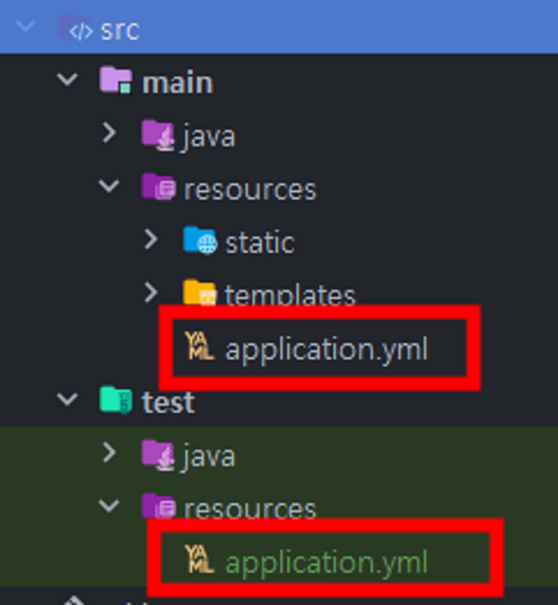
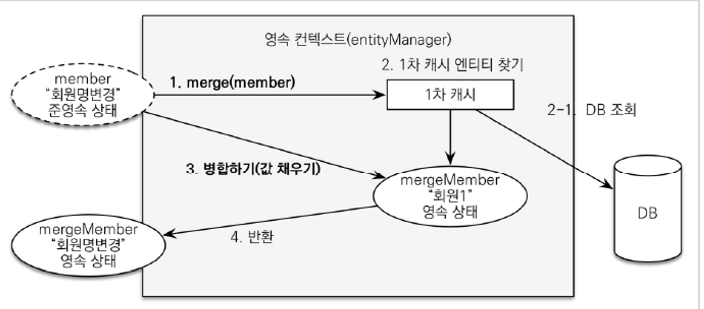

# 스프링 부트와 JPA 활용 1

#### `springframework.ui.Model` : Controller에서 View로 데이터를 넘길 때 사용되는 객체 (바구니 역할)

<br>

#### 일반 `@Controller`메서드의 return은 화면(view 파일)의 이름을 가르킴

```java
@Controller
public class HelloController {
    @GetMapping("hello")
    public String hello(Model model) {
        model.addAttribute("data", "hello!!!");
        return "hello"; // hello.html 파일
    }
}
```

<br>

#### 어떻게 파일을 찾지?

- Spring Boot에서 thymeleaf viewName을 매핑 해줌
- 기본 default 파일 prefix, subfix
    - `prefix` : templates/
    - `subfix` : .html

<br>

#### `@Transactional`이 Test 클래스에서 실행될 경우 테스트가 종료되면 rollback 진행

- Rollback을 하지 않으려면 *`@Rollback*(*false*)`를 설정해주어야 함
- 롤백을 하는 이유 : 반복적인 테스트를 가능하게 하고, 각 테스트의 독립성을 보장하기 위해

<br>

#### 같은 영속성 컨텍스트 안에서는 id값이 같다면 같은 Entity 객체로 인식한다

- 같은 Transaction 안에 묶여 있을 경우는 기존에 관리되고 있는 Entity와 동일한 경우 1차 캐시를 통해 같은 객체를 사용하도록 동작

<br>

#### 관계형 데이터베이스에서는 FK 컬럼을 들고있는쪽이 1:다 관계에서 “다”를 맡는다

- 연관 관계의 주인쪽에 값을 세팅해야 값이 변경된다
- 외래 키가 있는 곳을 연관관계의 주인으로 정하는 것이 좋다

<br>

#### 관계형 DB에서 다:다 관계는 불가능하기 때문에 중간 테이블을 둬서 해결한다

- 일대다 관계 —— 중간 테이블 —— 다대일 관계
- `@ManyToMany`는 실무에서 사용하지 말자
    - 중간 테이블에 필요한 컬럼들을 유연하게 추가하지 못한다

1:1 관계인 `@OneToOne`에서는 FK를 어디다 두든 각자 장단점이 있어 상관이 없지만, Access가 많이 일어나는 쪽에 두는 것이 편함

<br>

### 모든 연관관계는 지연로딩으로 설정해야 한다

- `@ManyToOne(fetch = FetchType.LAZY)`
- `fetch = FetchType.EAGER` 로 설정하면 골치아픔 (N + 1 문제 빵빵 터짐)
- 만약 한방에 join으로 같이 데이터를 가져와야 되는 로직이라면, fetch join 또는 엔티티 그래프 기능을 사용하자

### `xxToMany` 처럼 여러개를 찌르는 친구는 default가 `FetchType.LAZY`로 설정되어 있음
- 하지만 `xxToOne` 같이 **하나를 찌르는 친구**는 default가 `FetchType.EAGER` !!!
    - 마지막이 One인 애는 그냥 LAZY로 다 설정해주자
    - *`@ManyToOne*(fetch = FetchType.LAZY)`
    - *`@OneToOne*(fetch = FetchType.LAZY)`

<br>

#### 왜 지연로딩이여야 할까?

EAGER를 하이버네이트에서 추천하는 이유는 쿼리를 가져올 때 한번에 가져오는 작업을 최적화 해주는 메커니즘이다.

하지만 `em.find()` 같이 엔티티 매니저를 직접 사용하는 것이 아닌, JPA가 지원해주는 기능(JPQL)을 사용한다면 N+1 문제가 발생할 가능성이 매우 높아진다.

- JPQL은 EAGER인지 모르고 그냥 select * from order을 번역해 가져온 데이터를 객체에 넣는다
- 이후 어노테이션에 EAGER로 설정되어있다면 뒤늦게 아뿔싸하고 가져온 데이터이 관한 모든 연관 데이터를 가져온다
    - 100개를 가져왔다면 해당 데이터의 연관데이터를 다 가져와야되므로 100방이 더 나간다

<br> 

💡 Lazy로 설정하면 트랜잭션 밖에서 안돼서 LazyLoadingException이 나는 경우에는

- OSIV
- 트랜잭션을 빨리 가져오기
- fetch join

으로 해결하면 된다 (굳이 EAGER로 해결할 필요 없다)

<br>

#### 엔티티 멤버 중 컬렉션(ex `List<>`) 는 필드에서 바로 초기화 하는 것이 best practice이다

- 하이버네이트에 영속(`persist()`)화가 진행되면 자체 프록시로 한번 감싸기 때문에, 웬만하면 변경(재할당)되지 않는 것이 바람직하다
    - 엔티티의 **변경상태를 감지**해야하기 때문
    - 따라서 컬렉션을 변경한다면 JPA의 기본 메커니즘대로 동작을 안할 가능성이 있음
- 컬렉션을 필드에서 초기화 한 것을 당연히 밖에서 재할당을 해서도 안된다
    - `final`을 붙이면 좋을 듯 하다

<br>

### 테이블, 컬럼명 생성 전략은 설정에서 변경 가능함

- 회사 룰대로 맞춰서 변경하면 될 듯 (논리명, 물리명 적용)

<br>

### casecade - 전파

- 일반적으로 엔티티 안에 다른 엔티티 객체를 포함하고 있을 때, 포함하고 있는 엔티티에 관련 데이터를 저장 후 본 엔티티를 저장한다
    - orderItems의 데이터들을 각각 `persist(OrderItem)`를 진행한 후에
    - `persist(order)`를 진행한다

    ```java
    @Entity
    @Table(name = "orders")
    @Getter @Setter
    public class Order {
    
        @Id @GeneratedValue
        @Column(name = "order_id")
        private Long id;
    
        @OneToMany(mappedBy = "order")
        private List<OrderItem> orderItems = new ArrayList<>();
    }
    
    /* JPA 동작
    	persist(orderItemA)
    	persist(orderItemB)
    	persist(orderItemC)
    	persist(order)
    */
    ```

- `cascade = CascadeType.All`을 설정해주면 본 엔티티만 persist()를 진행해도 각각의 포함된 엔티티들에게 전파가 되는 효과
    - `persist(order)` 한번만 동작
    - DELETE 또한 같이 다 지워버림


<br>

### `cascade` 설정을 하는 경우

- persist 해야하는 라이프 사이클이 완전 동일 할 때
- 엔티티를 참조하는 주인이 오로지 하나(private owner)인 경우에만 사용해야 한다
    - 현재 예제 코드에서 `Delivery`랑 `OrderItem`은 `Order` 에서만 참조해서 사용하고, Order가 persist 될 때 같이 persist 되야 하므로 cascade 조건이 맞아 `cascade = ALL` 설정 사용

    ```java
    @Entity
    @Table(name = "orders")
    @Getter @Setter
    public class Order {
        // 현재 Order에서만 참조하여 사용중이므로 cascade 설정
        @OneToMany(mappedBy = "order", cascade = ALL)
        private List<OrderItem> orderItems = new ArrayList<>();
    
        // 현재 Order에서만 참조하여 사용중이므로 cascade 설정
        @OneToOne(cascade = ALL, fetch = LAZY)
        @JoinColumn(name = "delivery_id")
        private Delivery delivery;
    }
    ```

- 만약 다른 곳에서도 참조하는 곳이 있거나, 라이프 사이클이 감이 잘 안잡힐 경우 cascade를 사용하지 말고 persist를 각각 해주자!!

> `cascade`를 사용하면 추가할 때 같이 추가되고, 삭제할 때 같이 삭제된다 (전이, 전파)


<br>


### 연관 관계 메서드 (기본편 참조)

- 엔티티 안에 연관된 다른 엔티티에 좀 더 쉽게 멤버에 데이터를 세팅하기 위한 메서드
- DB 저장과는 별도로 객체에 값이 채워져야 사용성에 좋기 때문에 사용
    - DB 저장은 연관 관계 주인이 바뀌면 알아서 바뀔거니 논외
- 연관 관계 편의 메서드는 주로 **핵심적으로 컨트롤 하는 도메인**이 갖고 있는 것이 사용성에 좋음

```java
@Entity
@Table(name = "orders")
@Getter @Setter
public class Order {

    @Id @GeneratedValue
    @Column(name = "order_id")
    private Long id;

    @ManyToOne(fetch = LAZY)
    @JoinColumn(name = "member_id")
    private Member member;

    @OneToMany(mappedBy = "order", cascade = ALL)
    private List<OrderItem> orderItems = new ArrayList<>();

    @OneToOne(cascade = ALL, fetch = LAZY)
    @JoinColumn(name = "delevery_id")
    private Delevery delevery;

    // == 연관관계 편의 메서드 ==
    public void setMember(Member member) {
        this.member = member;
        member.getOrders().add(this);
    }

    public void addOrderItem(OrderItem orderItem) {
        orderItems.add(orderItem);
        orderItem.setOrder(this);
    }

    public void setDelevery(Delevery delevery) {
        this.delevery = delevery;
        delevery.setOrder(this);
    }
}
```

```java
public static void main(String[] args) {
    Member member = new Member();
    Order order = new Order();
    OrderItem orderItem = new OrderItem();
    Delevery delevery = new Delevery();
    
    order.setMember(member); // member의 orders까지 세팅
    order.addOrderItem(orderItem); // orderItem의 order까지 세팅
    order.setDelevery(delevery); // delevery의 order까지 세팅
}
```

<br>

#### test 폴더 경로에 resources 폴더가 있을 경우 테스트 실행 시 해당 패키지가 우선권을 가진다

> application.yml을 테스트용 환경과 실제 부트 환경을 격리시킬 수 있다
 

- h2 database를 인메모리 환경으로 세팅
    - `url: jdbc:h2:mem:test`
- h2 database를 실제 외부 db 환경으로 세팅
    - `url: jdbc:h2:tcp://localhost/~/data/inflearn/jpashop`
- 따라서 부트 환경과 테스트 환경의 설정을 따로 가져가자

    

<br>


### 도메인 모델 패턴

- 비즈니스 로직은 도메인 엔티티 안에 구현한다
- 서비스 계층은 단순히 엔티티에 필요한 요청을 위임하는 역할이다
- SQL을 직접 다루지 않아도 되는 경우(JPA)애 많이 사용됨

### 트랜잭션 스크립트 패턴

- 엔티티에는 비즈니스 로직이 거의 없음
- 서비스 계층에서 대부분의 비즈니스 로직을 처리
- SQL을 직접 다뤄야되는 경우에 많이 사용됨


<br>

### MyBatis vs JPA

- Mybatis 혹은 iBatis의 장점은 동적인 쿼리를 쉽게 생성할 수 있다
- JPA에서는 QueryDSL 라이브러리로 많은 부분을 보완할 수 있다
- 동적인 쿼리나 복잡한 쿼리가 많은 모듈이라면 MyBatis가 더 나을수도 있을 거 같음

<br>

#### API는 스팩이므로 절대 응답할 때 Entity를 그대로 넘기지 말고 DTO를 사용하자

- 비밀번호가 내려가면 대참사
- 엔티티를 변경했다고 API 스팩이 변경될 경우 불안정한 스팩으로, 이를 사용 하는 쪽도 불안해진다
- View 템플릿 엔진은 어차피 서버사이드 렌더링에서 알아서 필요한 데이터만 내려가긴 하지만 그래도 웬만하면 필요한 데이터만 담긴 DTO로 반환하자

<br>

### 변경감지 == dirty checking

- 트랜잭션 commit 시점에 flush가 일어날 때 변경 값들을 찾아서 DB에 쿼리를 날려줌

```java
@Transactional
public void updateItem(Long itemId, Book param) {
    Item findItem = itemRepository.findOne(itemId);
    findItem.setPrice(param.getPrice());
    findItem.setName(param.getName());
    findItem.setStockQuantity(param.getStockQuantity());
}
```

### 병합 (merge)

- 준영속 엔티티 : 영속성 컨텍스트가 더는 관리하지 않는 엔티티
    - 이미 DB에 한번 저장되어 식별자(고유 id)가 존재하는 객체
        - 임의로 만든 객체(ex. `Book book = new Book()`)에도 기존 식별자를 갖고 있다면 준영속 엔티티로 볼 수 있음
    - `@Transactional`이 없는 곳에서 엔티티를 조회한 객체

> 병합을 실무에선 절대 사용하면 안된다!
>
- 병합 동작 방식
    1. `merge()`를 통해서 영속성 엔티티를 1차 캐시에서 조회
        - 1차 캐시에 없으면 DB에서 조회
    2. 조회한 영속성 엔티티에 병합(merge)한 엔티티의 정보들을 모두 들이 붓는다(**덮어 씌우기**)
    3. 들이부어서 DB에 적용한 영속 상태 엔티티를 반환한다

   


> 즉 값의 수정을 막기 위해 일부로 컨트롤러에서 받지 않았는데도, 안받은 컬럼들은 모두 null로 반영된다 (진짜 큰일남!!)
>
- 애초에 병합(merge)의 동작이 내부적으로, 준영속 엔티티의 식별자(id)로 조회해가지고 와서 그 영속 엔티티를 준영속 엔티티 값으로 모두 덮어씌워버리고 트랜잭션 커밋 시점에서 변경 감지 기능이 동작해 DB에 UPDATE 쿼리가 날라감
- 그니까 그냥 영속 엔티티를 조회해서 변경할 값들만 딱딱 변경해주자!
- **컨트롤러에서 엔티티를 어설프게 생성해서 넘겨주지말고, 트랜잭션이 있는 Service 계층으로 DTO를 넘겨서 엔티티를 영속화시키자!!!!!!!!!!!!!!!!!**

<br>

#### set으로 수정 하지말고 의미있는 수정 메서드(ex. `item.change()`)를 만들어서 사용하자

- 데이터의 변경지점을 엔티티 레벨에서 추적할 수 있게 응집하자

<br>

#### `@RequestParam` 값은 select나 input같은 태그의 `name` attribute으로 올라오는 값이 바인딩 된다

- `<select *name*="memberId" *id*="member" *class*="form-control">`
    - *`@RequestParam*("memberId") Long memberId`
- `<select *name*="itemId" *id*="item" *class*="form-control">`
    - *`@RequestParam*("itemId") Long itemId`
- `<input *type*="number" *name*="count" *class*="form-control" *id*="count">`
    - *`@RequestParam*("count") *int* count`

<br>

#### 임베디드 타입이 뭐지?

- 포함 관계 객체를 뜻하는 듯 함
